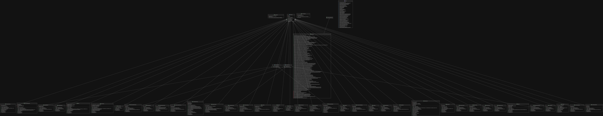

# Manual Técnico -  Traductor Codex Latinux
### *Universidad San Carlos de Guatemala - Division Ciencias de la Ingeniería - Centro Universitario de Occidente (CUNOC)*
### *Organización de Lenguajes y Compiladores 2*

---

## 1. Tecnologías utilizadas
- ANTLR4 -> generación de gramatica
- Intellij IDE versión 2025.2.6.2 (Para mayor compatibilidad con plugin de ANTLR4 en Intellij IDE)
- Java version 21.0.11-temurin
- Maven version 3.9.12 (non_canonical)
- Sistema Operativo: Solus Linux

## 2. Arquitectura del Sistema
El traductor está diseñado siguiendo el patrón clásico de pipeline para procesadores de lenguajes. El flujo de procesamiento se divide en etapas desacopladas que transforman el código fuente a el lenguje destino (PigLatin).

```text
[Código Fuente] ──> [ Analizador Léxico ] ──> (Lista de Tokens)
                            │
                            ▼
                    [Analizador Sintáctico] ──> (Lista de errores)
                            │
                            ▼
                    [ Analizador Semántico ] ──> (Lista de errores)
                            │
                            ▼
                    [Resultado / Traducción]
```

---

## 3. Diagrama de clases
Este diagrama representa el AST personalizado (no el generado por ANTRL4). Puede encontrar el diagrama dentro del directorio resources.


## 4. Especificaciones del Lenguaje

- ### **Palabras reservadas y Símbolos**
```jflex

lexer grammar LatinLexer;

// Rules of tokens (Terminals)

// Comments
LINE_COMMENT: '//' ~[\r\n]* -> skip;
BLOCK_COMMENT: '##' (~'#' | '#' ~'#')* '##' -> skip;

// Aritmetic
PLUS: '+';
MINUS: '-';
MULT: '*';
SPLIT: '/';

// Declaration blocks
VARIABILES_INIT: 'VARIABILES>';
MUNERA_INIT: 'MUNERA>';
MAIOR_INIT: 'MAIOR>';
FINIS_EOF: 'FINIS';

// Relational
IDENTIC: '==';
DIFF: '!=';
MAJORTO: '>=';
MINORTO: '<=';
MINOR: '<';
MAJOR: '>';
ASSIGN: '=';

// Logical
AND: '&&';
OR: '||';

// Negation
NOT: 'non';

// Add/Subtract one unit
ADD: '++';
SUB: '--';

// Punctuation
COLON: ':';
SEMICOLON: ';';
COMMA: ',';
DOT: '.';

// Structural
LEFT_CLASP: '[';
RIGHT_CLASP: ']';
LEFT_BRACE: '{';
RIGHT_BRACE: '}';
LEFT_PAREN: '(';
RIGHT_PAREN: ')';

// Reserved Words
ESTO: 'esto';
NUMERUS: 'numerus';
TEXTUM: 'textum';
DECIMALIS: 'decimalis';
BOOL: 'bool';
LITTERA: 'littera';
VERUM: 'verum';
FALSUS: 'falsus';
SERIES: 'series';
STRUCTURA: 'structura';
FINIS: 'finis';
SI: 'si';
ALITER: 'aliter';
DUM: 'dum';
FACERE: 'facere';
PER: 'per';
PERGE: 'perge';
INTERRUMPE: 'interrumpe';
ACTIO: 'actio';
VARIABILES: 'VARIABILES';
MUNERA: 'MUNERA';
MAIOR: 'MAIOR';
RATIO: 'ratio';
REDDERE: 'reddere';
LEERE: '<<';
IMPREMERE: '>>';

// Identifiers
ID: [a-zA-Z_][a-zA-Z0-9_]*;

// Literal Values
DECIMAL: [0-9]+ '.' [0-9]+;
INTEGER: [0-9]+;
STRING: '"' ( '\\' . | ~["\\] )* '"';
CHAR: '\'' ( '\\' . | ~['\\] ) '\'';

// Ignore
WS: [ \t\r\n]+ -> skip;

```
- ### **Gramática:**
Esta gramática está basada en el lenguaje de **Latín**, es un lenguaje de tipado estático y secuencial.

```bnf
(*
  Los terminales en MAYÚSCULAS corresponden a tokens del lexer.
*)

program ::=
    [ VARIABILES_INIT globalDeclarations ]
    [ MUNERA_INIT functionDefinitions ]
    MAIOR_INIT mainInstructions
    FINIS_EOF
    [ SEMICOLON ]
    EOF ;

globalDeclarations ::=
    { globalDeclaration } ;

globalDeclaration ::=
      declaration
    | arrayDeclaration
    | structDefinition ;

functionDefinitions ::=
    { functionDefinition } ;

mainInstructions ::=
    { instruction } ;

instruction ::=
      assignment
    | readStatement
    | printStatement
    | ifStatement
    | whileStatement
    | doWhileStatement
    | forStatement
    | jumpStatement
    | returnStatement
    | expression SEMICOLON ;

declaration ::=
    ESTO ID [ COLON ] [ type ] expression [ SEMICOLON ] ;

arrayDeclaration ::=
    SERIES ID LEFT_CLASP expression RIGHT_CLASP
    [ COLON ] [ type ]
    [ LEFT_BRACE arrayValues RIGHT_BRACE ]
    [ SEMICOLON ] ;

arrayValues ::=
    expression { COMMA expression } ;

structDefinition ::=
    STRUCTURA ID LEFT_BRACE
        structFieldDeclaration
        { structFieldSeparator structFieldDeclaration }
    RIGHT_BRACE FINIS SEMICOLON ;

structFieldDeclaration ::=
      ESTO ID COLON type
    | SERIES ID COLON type ;

structLiteral ::=
    [ ID ] LEFT_BRACE
        [ structFieldInitializer { COMMA structFieldInitializer } ]
    RIGHT_BRACE ;

structFieldInitializer ::=
    ID COLON expression ;

structFieldSeparator ::=
      COMMA
    | SEMICOLON ;

ifStatement ::=
    SI LEFT_PAREN booleanExpression RIGHT_PAREN block
    { elseIfClause }
    [ elseClause ]
    FINIS SEMICOLON ;

elseIfClause ::=
    ALITER LEFT_PAREN booleanExpression RIGHT_PAREN block ;

elseClause ::=
    ALITER block ;

whileStatement ::=
    DUM LEFT_PAREN booleanExpression RIGHT_PAREN block
    FINIS SEMICOLON ;

doWhileStatement ::=
    FACERE block
    DUM LEFT_PAREN booleanExpression RIGHT_PAREN SEMICOLON ;

forStatement ::=
    PER LEFT_PAREN forInit SEMICOLON forCondition SEMICOLON [ forUpdate ] RIGHT_PAREN block ;

jumpStatement ::=
      PERGE SEMICOLON
    | INTERRUMPE SEMICOLON ;

functionDefinition ::=
      ACTIO ID LEFT_PAREN [ parameterList ] RIGHT_PAREN functionBody FINIS SEMICOLON
    | RATIO type ID LEFT_PAREN [ parameterList ] RIGHT_PAREN functionBody FINIS SEMICOLON ;

functionBody ::=
    LEFT_BRACE [ varSection ] { instruction } RIGHT_BRACE ;

parameter ::=
    ESTO ID COLON type ;

parameterList ::=
    parameter { COMMA parameter } ;

argumentList ::=
    expression { COMMA expression } ;

returnStatement ::=
    REDDERE expression SEMICOLON ;

varSection ::=
    VARIABILES LEFT_CLASP { declaration } RIGHT_CLASP ;

forInit ::=
      ESTO ID [ COLON ] [ type ] expression
    | lvalue ASSIGN expression
    | ID ;

forCondition ::=
    booleanExpression ;

forUpdate ::=
      expression
    | lvalue ASSIGN expression ;

block ::=
    LEFT_BRACE { instruction } RIGHT_BRACE ;

arrayCreation ::=
    type LEFT_CLASP expression RIGHT_CLASP ;

arrayLiteral ::=
    LEFT_BRACE expression { COMMA expression } RIGHT_BRACE ;

type ::=
      NUMERUS
    | TEXTUM
    | DECIMALIS
    | LITTERA
    | VERUM
    | FALSUS
    | BOOL
    | ID ;

readStatement ::=
    lvalue LEERE [ SEMICOLON ] ;

printStatement ::=
    IMPREMERE printItem { IMPREMERE printItem } [ SEMICOLON ] ;

printItem ::=
      STRING
    | ID
    | expression ;

lvalue ::=
    ID { lvalueSufix } ;

lvalueSufix ::=
      DOT ID
    | LEFT_CLASP expression RIGHT_CLASP ;

assignment ::=
    lvalue ASSIGN expression [ SEMICOLON ] ;

expression ::=
      booleanExpression
    | numericExpression
    | stringExpression
    | structLiteral
    | arrayCreation
    | arrayLiteral ;

booleanExpression ::=
    booleanOrExpression ;

booleanOrExpression ::=
    booleanAndExpression { OR booleanAndExpression } ;

booleanAndExpression ::=
    comparisonExpression { AND comparisonExpression } ;

comparisonExpression ::=
      NOT comparisonExpression
    | comparisonOperand [ relationalLiteral comparisonOperand ]
    | LEFT_PAREN booleanExpression RIGHT_PAREN ;

comparisonOperand ::=
      numericExpression
    | booleanLiteral
    | stringExpression ;

numericExpression ::=
    additiveExpression ;

additiveExpression ::=
    multiplicativeExpression { plusMinusExpression multiplicativeExpression } ;

multiplicativeExpression ::=
    unaryExpression { multSplitExpression unaryExpression } ;

unaryExpression ::=
      ( addSubExpression ) unaryExpression
    | primaryNumeric ;

addSubExpression ::=
      PLUS
    | MINUS
    | ADD
    | SUB ;

incrementDecrementLiteral ::=
      ADD
    | SUB ;

multSplitExpression ::=
      MULT
    | SPLIT ;

plusMinusExpression ::=
      PLUS
    | MINUS ;

stringExpression ::=
    stringAdditiveExpression ;

stringAdditiveExpression ::=
    stringPrimary { PLUS stringAdditiveItem } ;

stringAdditiveItem ::=
      stringPrimary
    | numericExpression ;

stringPrimary ::=
      STRING
    | CHAR
    | ID { atributeAccessExpresion } ;

primaryNumeric ::=
      numericLiteral
    | ID { atributeAccessExpresion } [ incrementDecrementLiteral ]
    | LEFT_PAREN numericExpression RIGHT_PAREN ;

numericLiteral ::=
      INTEGER
    | DECIMAL
    | CHAR
    | booleanLiteral ;

booleanLiteral ::=
      VERUM
    | FALSUS ;

relationalLiteral ::=
      IDENTIC
    | DIFF
    | MINOR
    | MAJOR
    | MINORTO
    | MAJORTO ;

atributeAccessExpresion ::=
      DOT ID
    | LEFT_CLASP expression RIGHT_CLASP
    | LEFT_PAREN [ argumentList ] RIGHT_PAREN ;
```

## 5. **Tabla de Compatibilidad de Tipos**
|   Tipo   |    Tipo    |   Conversión   |
| -------- |  -------   |  ------------  |
| NUMERUS  |  NUMERUS   |    NUMERUS     |
| DECIMALIS| DECIMALIS  |   DECIMALIS    |
| NUMERUS  | DECIMALIS  |   DECIMALIS    |
| TEXTUM   |  ANYTHING  |    TEXTUM      |

