# Manual Técnico -  Traductor Codex Latinux
### *Universidad San Carlos de Guatemala - Division Ciencias de la Ingeniería - Centro Universitario de Occidente (CUNOC)*
#### *Organización de Lenguajes y Compiladores 2*

---

## 1. Introducción
Este traductor está pensado para ayudar en la traducción de lenguaje Latín a PigLatin usando ANTLR4 como herramiento de generacion de analizadores Léxicos y Sintácticos.

## 2. Requisitos Previos para el Usuario
Para poder interactuar con el programa, el usuario final debe contar con:
* Entorno de ejecución de Java (JRE) instalado.
* Entorno de Desarrollo de Java (JDK 21) instalado.
* Entorno Maven instalado.

---

## 3. Modos de Operación y Uso

### 3.1 Interfaz Gráfica

* **Comando de Inicio:** `practica-piglatin-1.0-SNAPSHOT-jar-with-dependencies.jar` Es importante que se ejecute con dependencias para que no se tengan errores con librerias.

* **Inicio:** 
Al ejecutar el archivo jar se vera la siguiente interfaz
    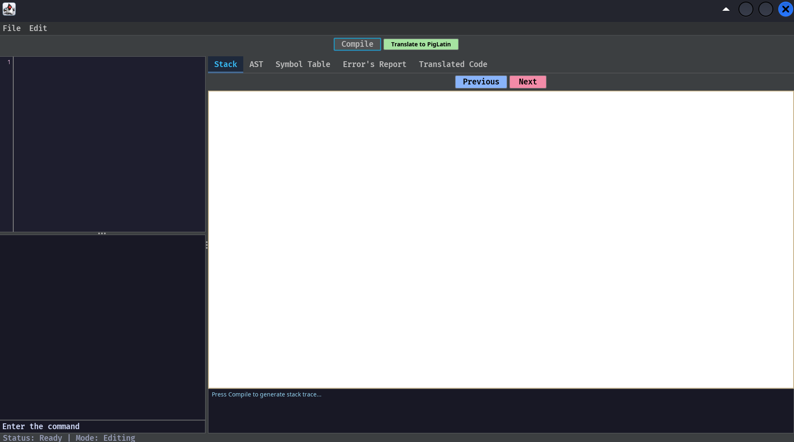

* **Menu Archivo:** 
En la parte superior se encuentra una barra de modos. Al seleccionar Archivo se desplegara un submenu con diferentes opciones
    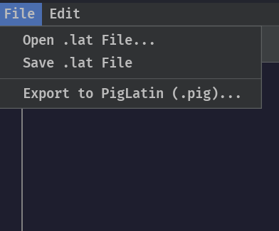

* **Open .lat File:** 
Al seleccionar esta opción se abrira el selector de archivos. Solo podran subirse archivos con extensión .glt
 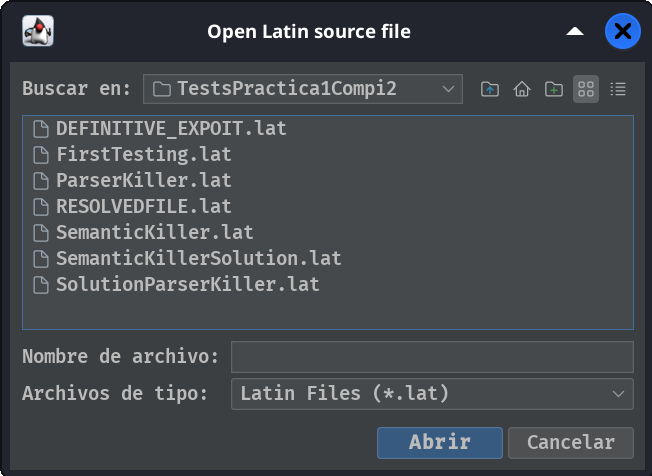
 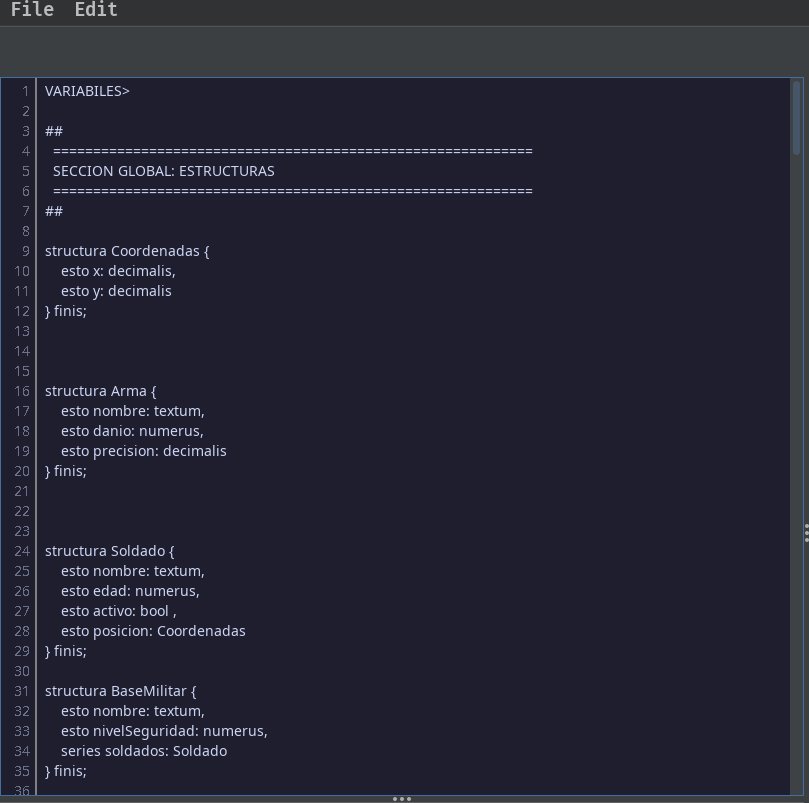

 * **Guardar:**
Al seleccionarse se guardaran los cambios realizados en el archivo en el que se esta trabajando actualmente.

* **Consola:**
La consola es el modulo donde se podrá observar información importante al momento de compilar nuestro código.

* **Compilar:**
Este boton permite la ejecución del contenido del archivo mostrando la salida en consola. Dependiendo podemos encontrar dos escenarios.

**Compilacion con Errores**
 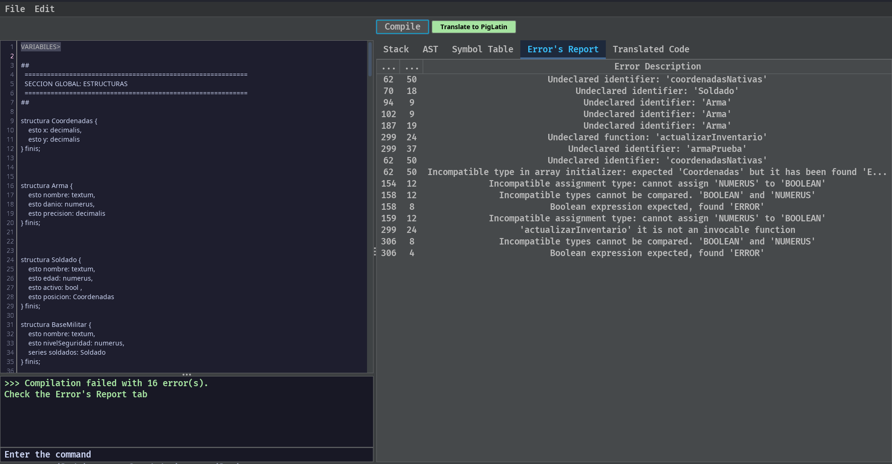
 **Compilacion Sin Errores**
 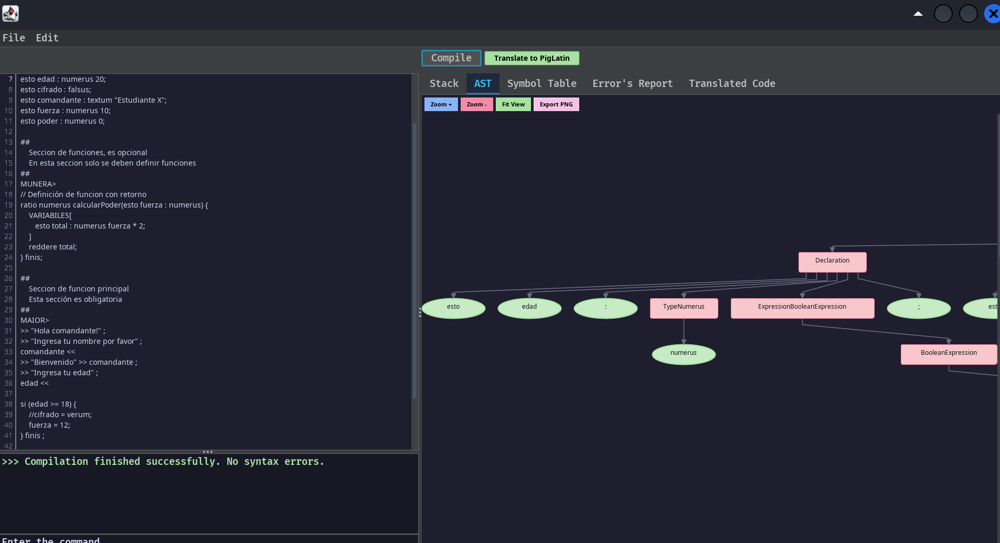

* **Stack:**
Esta ventana permite observar como se ha ido transformando la pila a lo largo del analisis. Es posible ir hacía adelante y hacía atrás
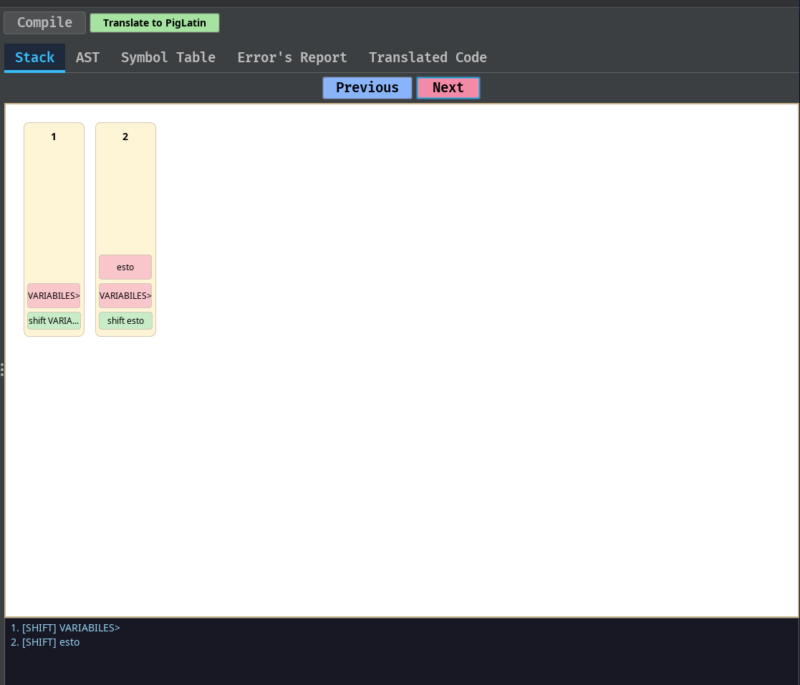

* **AST:**
Esta ventana muestra el arbol de derivacion. Permite acercar, alejar y Exportar a PNG
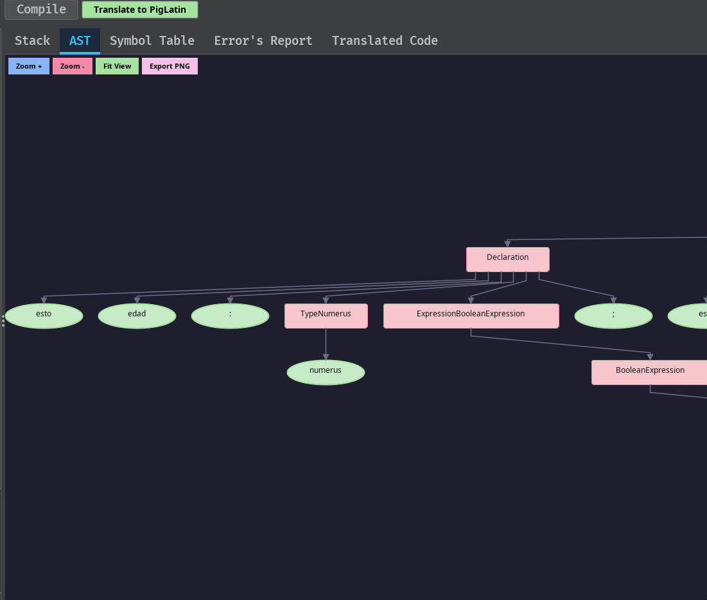

* **Symbol Table:**
Esta ventana muestra tanto la tabla de symbolos como de tipos con información necesaria para el usuario.
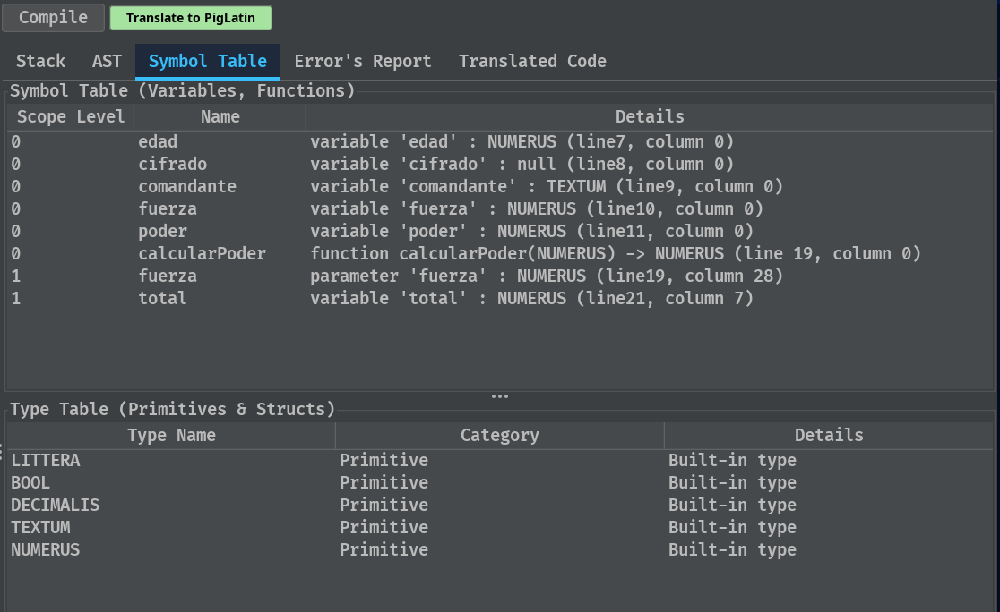

* **Error Report:**
Esta ventana muestra tanto la tabla de symbolos como de tipos con información necesaria para el usuario.
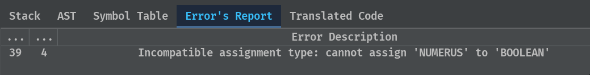

* **Translate to PigLatin:**
Este boton permite generar el codigo traducido a PigLatin. Automaticamente se redirijira a esa ventana.
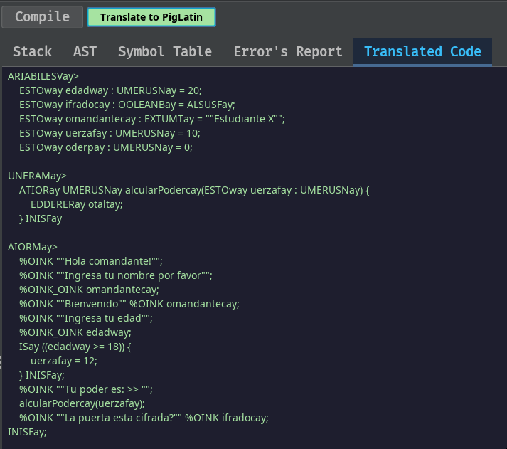

* **Descarga de Archivos:**
Esta opcion dentro del menu File permite exportar el archivo .pig
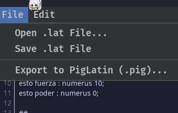